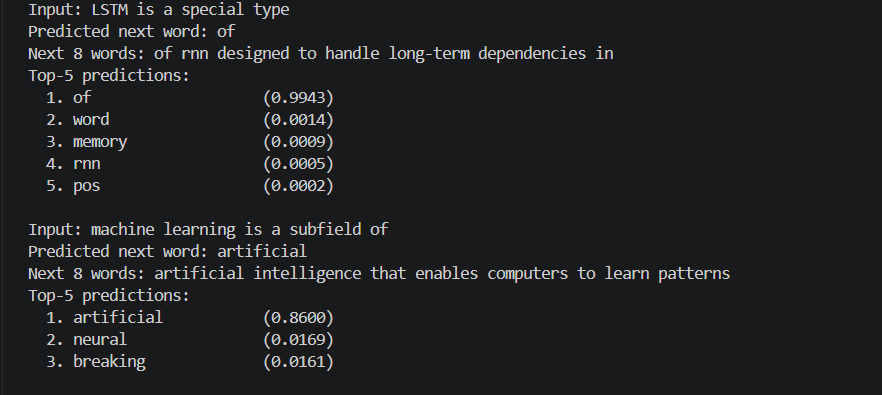

# Next Word Predictor

A simple LSTM model that learns from one PDF and predicts the next words based on the sentence you type.
The model reads the text, learns common word patterns, and understands which words usually come next.
When you enter a sentence, it uses the learned patterns to predict and generate the next words.


## Purpose

The project is a complete and readable training pipeline for next-word prediction. It starts with a study-note PDF, processes the text to train an LSTM model, and then uses the trained model to generate the next words based on a user-provided prompt.The corpus is intentionally small, as the project is designed to demonstrate each stage of the pipeline rather than build a large language model.


## Features

- Extracts text from a PDF with PyMuPDF
- Cleans study-note noise: headers, page numbers, the table of contents, formula lines, and leftover equation tokens
- Builds a word vocabulary with `<PAD>` and `<UNK>`
- Creates fixed-length context windows and trains an Embedding → LSTM → Dense model
- Reports test loss, top-1 accuracy, and top-3 / top-5 accuracy
- Prints sample predictions, then accepts your own sentences in a terminal

## Technologies

- Python 3.12
- TensorFlow / Keras
- NumPy
- PyMuPDF (`pymupdf`)

## Project architecture

`main.py` is the entry point. It calls the pipeline functions in `src/engine.py`. The engine delegates each stage to a helper or to the model code:

```text
main.py
  ↓
src/engine.py
  ↓
utils/pdf_extractor.py
  ↓
utils/text_cleaner.py
  ↓
utils/vocabulary.py
  ↓
utils/analyzer.py          (called from main.py after the vocabulary is built)
  ↓
src/model.py
  ↓
src/trainer.py
  ↓
data/output/
```

`main.py` writes `data/output/extracted_text.txt` and `data/output/cleaned_text.txt`. Training, evaluation, and prediction stay in `src/`. PDF extraction stays in `utils/` because it is a small file helper, not model or training logic. Paths are built from the project directory (`src/engine.py`), so the PDF is found even if the shell is not sitting in the project root.

```text
Integer IDs
    ↓
Embedding (128 dimensions, mask_zero=True)
    ↓
LSTM (128 units, dropout 0.1)
    ↓
Dropout (0.2)
    ↓
Dense + Softmax (vocab_size + 1 outputs)
```

- **Context size:** 10 (number of previous words used as input)
- **Embedding dimension:** 128
- **LSTM units:** 128
- **Optimizer:** Adam (lr=0.002, with ReduceLROnPlateau)
- **Loss:** Sparse Categorical Crossentropy
- **Regularization:** LSTM dropout=0.1, recurrent dropout=0, Dense dropout=0.2

Recurrent dropout is off so the memory cell can carry the previous word forward. On a few thousand tokens, dropout of 0.3 on both the input and the recurrence stopped training while the network was still worse than a bigram table.

## Directory structure

```text
Next_Word_Predictor/
│
├── .venv/                            # Local virtual environment (gitignored)
├── data/
│   ├── input/
│   │   └── document.pdf              # Source PDF (ML/NLP/LLM study notes)
│   └── output/
│       ├── .gitkeep                  # Keeps the output folder in git
│       ├── analysis_report.txt       # Reserved; not written by the pipeline
│       ├── cleaned_text.txt          # Cleaned text written by main.py
│       ├── extracted_text.txt        # Raw PDF text written by main.py
│       └── log.txt                   # Saved console log from an earlier run
│
├── src/
│   ├── __init__.py                   # Package exports
│   ├── engine.py                     # Pipeline steps, paths, and hyperparameters
│   ├── model.py                      # Embedding → LSTM → Dense model
│   └── trainer.py                    # Compile, train, evaluate, predict
│
├── utils/
│   ├── __init__.py                   # Helper package exports
│   ├── analyzer.py                   # Vocabulary coverage report
│   ├── pdf_extractor.py              # PDF text extraction (PyMuPDF)
│   ├── text_cleaner.py               # Cleaning, tokens, windows, padding
│   └── vocabulary.py                 # Word-to-id mapping
│
├── Output.png                        # Terminal screenshot of sample predictions
├── main.py                           # Entry point
├── requirements.txt
├── .gitignore
└── README.md
```

`.venv/` is created locally and is not part of the source. Generated files under `data/output/` are ignored by git except `.gitkeep`. Cache folders, IDE settings, and `.env` are ignored as well.

## Important files

| File | Role |
| --- | --- |
| `main.py` | Entry point. `main()` runs the 13 pipeline steps and writes the two text outputs. In a real terminal it asks for sentences. |
| `src/engine.py` | Project paths, training settings, and each stage: extract, clean, tokenize, vocabulary, sequences, padding, split, tensors, model, training, evaluation, and prediction. |
| `tests/test_preprocessing.py` | Checks cleaning, vocabulary ids, and that paths point at this project. |
| `src/model.py` | Builds the Keras model. |
| `src/trainer.py` | Trains with early stopping, computes top-k accuracy, and predicts the next word or the next several words. |
| `utils/pdf_extractor.py` | Opens the PDF and returns its text. |
| `utils/text_cleaner.py` | Cleans the PDF text, tokenizes it, builds input/target windows, pads them, and adds short-context training copies. |
| `utils/vocabulary.py` | Counts tokens and assigns integer ids. `MIN_WORD_FREQUENCY` is 1. |
| `utils/analyzer.py` | Prints how much of the token stream the vocabulary keeps. |
| `data/input/document.pdf` | The only training document. |

## How the pipeline works

```text
PDF (data/input/document.pdf)
  ↓  Extract text (PyMuPDF)
  ↓
Raw text  →  data/output/extracted_text.txt
  ↓  Clean: remove headers/footers, formatting symbols, section numbers,
     normalize whitespace, lowercase, remove special characters
  ↓
Cleaned text  →  data/output/cleaned_text.txt
  ↓  Tokenize into words, filter single-char tokens
  ↓
Word tokens
  ↓  Build vocabulary (min frequency = 1)
  ↓
Word → Integer ID mapping
  ↓  Create sliding-window input/target pairs (context size = 10)
  ↓
Input sequences + target IDs
  ↓  Left-pad sequences to length 10
  ↓
Padded arrays (N, 10)
  ↓  Split: 80% train / 10% validation / 10% test (sequential)
  ↓  Training only: add copies that keep the last 1, 2, or 3 words
  ↓
Train / Val / Test sets
  ↓  Train Embedding → LSTM → Dense model
  ↓
Trained model
  ↓  Evaluate + predict
  ↓
Next word predictions
```

## Preprocessing

The text cleaning pipeline removes noise from the PDF:

1. **Header/footer removal:** Lines containing "compiled study notes" are removed
2. **Page number removal:** Standalone numbers and TOC dot leaders are removed
3. **Table of contents removal:** Heading lines between "Contents" and the first real prose sentence are dropped, because the body repeats them
4. **Formula-line removal:** Equation lines such as `ft = σ(Wf[ht−1, xt] + bf)` are dropped; prose that merely contains "=" is kept
5. **Section number removal:** Leading numbers like "1", "2.1", "3.2" are stripped
6. **Symbol removal:** Bullets (•), arrows (→), dashes, and equals signs are replaced with spaces
7. **Parentheses handling:** Abbreviations and expansions in parentheses, such as (ml) or (long short-term memory), are removed so they are not inserted into the sentence
8. **Special character removal:** Colons, semicolons, slashes, commas, periods, and quotes are removed
9. **Formula-variable removal:** Leftover tokens such as `ht`, `ct`, `wf`, and `bf` are dropped at tokenization, along with pure numbers
10. **Whitespace normalization and lowercase**
11. **Single-character filtering:** Only "a" and "i" are kept

## Vocabulary

- **Minimum word frequency:** 1 (every distinct word is kept)
- **Special tokens:** `<PAD>` (ID=0), `<UNK>` (ID=1)

`<UNK>` is only used for a word that never appeared in the document. A word that appears once, including "down" and "artificial", is a real class.

## Padding

- **Direction:** Pre-padding (left)
- **Pad value:** 0 (corresponds to `<PAD>` token)
- **mask_zero=True** in the Embedding layer ensures padding tokens are ignored by the LSTM

## Train / Validation / Test Split

- **80%** training, **10%** validation, **10%** test
- **Sequential split** (no shuffling) to preserve document order and avoid overlapping windows leaking into the test slice
- **Full windows:** 2,139 train / 267 validation / 268 test
- **Training set after short-context copies:** 8,556

Validation and test stay full 10-word windows. Only the training split receives the extra copies.

## Model and training

Full 10-word windows from this document almost never appear again later, so a network trained only on them memorizes prefixes that do not help the held-out section. For each training window the pipeline also adds three copies that keep just the last 1, 2, or 3 words and pad the rest. Those copies practice short transitions ("type" followed by "of", "context" followed by "important") that do show up again. The original full windows remain in the training set.

- **EarlyStopping:** Monitors `val_accuracy`, patience=6, restores best weights. Validation loss bottoms out while the model is still predicting "the" and "a"; accuracy on the later section keeps rising after that.
- **ReduceLROnPlateau:** Halves the learning rate when `val_accuracy` stalls for 4 epochs
- **Max epochs:** 40
- **Batch size:** 32
- **Learning rate:** 0.002

Training accuracy is not comparable to validation accuracy. Most training rows are the easier short copies, while validation and test are full windows only.

The model is built in memory for each run. It is not saved to disk.

## Evaluation

The model reports:

- **Test Loss** (Sparse Categorical Crossentropy)
- **Test Accuracy** (Top-1)
- **Top-3 Accuracy** (correct word appears in top 3 predictions)
- **Top-5 Accuracy** (correct word appears in top 5 predictions)

## Prediction

The prediction function:

1. Applies the **same cleaning rules** used during training
2. Tokenizes the cleaned input
3. Maps words to vocabulary IDs (unseen words → `<UNK>`)
4. Keeps only the last 10 tokens (context window)
5. Left-pads to length 10
6. Runs `model.predict()` to get probability distribution
7. Returns top-1 prediction plus top-k alternatives with probabilities

For a multi-word continuation, each predicted word is appended and the model is called again.

## Requirements

- Python 3.12
- The packages in `requirements.txt`: TensorFlow, PyMuPDF, and NumPy

## Installation

From the project root (`Next_Word_Predictor`):

### Virtual environment

Windows (PowerShell):

```powershell
python -m venv .venv
.venv\Scripts\Activate.ps1
```

Windows (Command Prompt):

```cmd
python -m venv .venv
.venv\Scripts\activate
```

macOS / Linux:

```bash
python -m venv .venv
source .venv/bin/activate
```

### Dependency installation

With the environment activated:

```bash
python -m pip install --upgrade pip
pip install -r requirements.txt
```

## How to run

```bash
python main.py
```

The PDF path is resolved from the project directory, so the command also works when the shell is somewhere else:

```powershell
.venv\Scripts\python.exe C:\path\to\Next_Word_Predictor\main.py
```

The script trains for up to 40 epochs, prints sample predictions, and, when stdin is a terminal, waits for your own sentences. Press Enter on a blank line to stop.

Checks that do not train the model:

```bash
python -m unittest discover -s tests
```

## Input and output locations

- **Input:** `data/input/document.pdf`
- **Output directory:** `data/output/`
  - `extracted_text.txt` — raw text from the PDF
  - `cleaned_text.txt` — text after cleaning
  - `analysis_report.txt` — present, but the current code does not write it
  - `log.txt` — a console capture from an earlier run, not produced by `main.py`

`main.py` creates `data/output/` if it is missing. Both paths are resolved from the location of `src/engine.py`, not from the shell's current directory.

## Example usage

After training, the script prints continuations for built-in prompts. In a terminal you can then type your own:

```text
Input: LSTM is a special type
Output: of rnn designed to handle long-term dependencies in
```

Measured with `python main.py` (seed 42). Test rows are full 10-word windows from the last 10% of the document.

```text
Earlier pipeline:
  Test Loss      = 4.9215
  Test Accuracy  = 5.88%   (Top-1)
  Top-3 Accuracy = 9.63%
  Top-5 Accuracy = 12.83%

This pipeline (min frequency = 1):
  Test Accuracy  = 8.58%   (Top-1)
  Top-3 Accuracy = 13.43%
  Top-5 Accuracy = 14.55%
```

The vocabulary is every word in the document (719 tokens, including `<PAD>` and `<UNK>`). After training, `python main.py` prints an 8-word continuation for each demo sentence.

### Prediction examples

After training, `main.py` prints this for each built-in prompt: the next word, an 8-word continuation, and the top 5 probabilities. The screenshot is from that step.



*Two of the sample prompts. "LSTM is a special type" continues with "of", and "machine learning is a subfield of" continues with "artificial".*

```text
Input:  LSTM is a special type
Output: of rnn designed to handle long-term dependencies in

Input:  machine learning is a subfield of
Output: artificial intelligence that enables computers to learn patterns

Input:  the model learns from context
Output: important points comparison methods cosine similarity euclidean distance
```

## Troubleshooting

- **`FileNotFoundError` for the PDF:** keep the file at `data/input/document.pdf` inside this project. The path does not depend on the current directory.
- **TensorFlow fails to import:** activate `.venv` and run `pip install -r requirements.txt` again.
- **No sentence prompt:** step 13 only reads input when stdin is a terminal. A redirected or non-interactive run still trains, prints the sample predictions, and says that the prompt was skipped.
- **Very slow first start:** TensorFlow's first import is slow. Later epochs are the long part of the run (up to 40).
- **Stale bytecode:** delete any `__pycache__` folders if an old module path is still being imported. They are gitignored.

## Known limitations

1. **Small dataset:** After cleaning, the document is 2,675 tokens. That is enough to learn short transitions and not enough to learn long-range style.
2. **Random baseline:** With 717 vocabulary words, guessing uniformly is about 0.1%. 8.6% top-1 is well above that. It is lower than the frequency-5 run because many test targets now appear only in the last section.
3. **One-time words are easy to miss on new text:** "down" and "artificial" are in the vocabulary and the example prompts return them, because those sentences are in the training portion. A word that appears only in the test section still has no earlier example to learn from.
4. **Capacity versus data:** The output layer now has one unit per word, about 322K parameters in total. Full 10-word windows are mostly unique, which is why training uses extra short copies.
5. **Single document:** Patterns are whatever this study-note PDF repeats. A later section written in a different shape (comparison tables, agent notes) is only partly predictable from earlier prose.

## How to improve further

- Add more documents so one-time words have more than a single example
- Keep this same architecture and context size; the limit is the corpus, not the layer types
